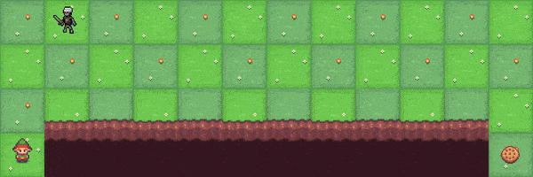

# Monster Cliff Walking



This environment is a modification of the [CliffWalking](https://gymnasium.farama.org/environments/toy_text/cliff_walking/) Toy Text environments from [Gymnasium](https://gymnasium.farama.org/).
General Information:

| | |
|---|---|
|Action Space |`Discrete(4)`|
|Observation Space |`Discrete(1728)`|
|import| see below|

```python
gym.register(
    id='MonsterCliffWalking-v0',
    entry_point='path/to/module/monstercliffwalking:MonsterCliffWalkingEnv'
)

gym.make('MonsterCliffWalking-v0')
```

Monster cliff walking involves crossing a gridworld from start to goal while avoiding falling off a cliff and meeting a Monster.

## Description

The game starts with the player at location [3, 0] of the 4x12 grid world with the
goal located at [3, 11]. If the player reaches the goal the episode ends. The Monster may starts on any square on
the upper 3x12 cells.

A cliff runs along [3, 1..10]. If the player moves to a cliff location it returns to the start location.

There is a monster randomly roaming around. With each time step the monster either moves in one of 4 directions or stands still.
If the player encounters the Monster the episodes terminates with a huge penalty.

Adapted from Example 6.6 (page 132) from Reinforcement Learning: An Introduction
by Sutton and Barto [<a href="#cliffwalk_ref">1</a>].

Code modified from:
[https://github.com/Farama-Foundation/Gymnasium/blob/main/gymnasium/envs/toy_text/cliffwalking.py](https://github.com/Farama-Foundation/Gymnasium/blob/main/gymnasium/envs/toy_text/cliffwalking.py)

## Action Space

The action shape is `(1,)` in the range `{0, 3}` indicating
which direction to move the player.

- 0: Move up
- 1: Move right
- 2: Move down
- 3: Move left

## Observation Space

There are 4x12 x 3x12  possible states. All possible player states multiplied by all possible monster states.

The observation is an integer value representing the current combination of player and monster position as
current_row * nrows + current_col for both entities and than using the Szudzik pairing function and a simple dictionary mapping to make
the state indices dense.

The observation is returned as an `int()`.

## Starting State

The episode starts with the player in location [3, 0] and the monster anywhere in its 3x12 grid.

## Reward

Each time step incurs -1 reward, unless the player stepped into the cliff,
which incurs -100 reward.
Encountering the monster incurs -1000 reward.

## Episode End

The episode terminates when the player enters location [3, 11] or encounters the monster.

## Information

`step()` and `reset()` return a dict with the following keys:

- "prob" - transition probability for the state.

Monster cliff walking is stochastic, as the movement of the monster is random.

## Arguments

```python
import gymnasium as gym

gym.register(
    id='MonsterCliffWalking-v0',
    entry_point='path/to/module/monstercliffwalking:MonsterCliffWalkingEnv'
)

gym.make('MonsterCliffWalking-v0')
```

## References

<a id="cliffwalk_ref"></a>[1] R. Sutton and A. Barto, “Reinforcement Learning:
An Introduction” 2020. [Online]. Available: [http://www.incompleteideas.net/book/RLbook2020.pdf](http://www.incompleteideas.net/book/RLbook2020.pdf)

## Version History

- v0: Initial version release
